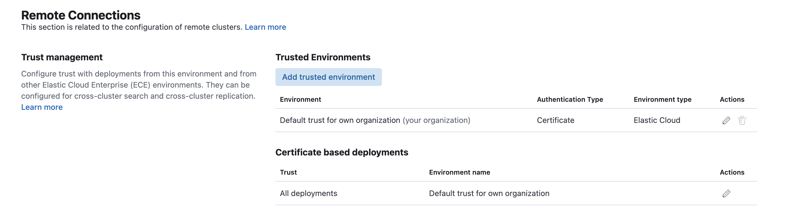

# Stack UAM Automation

This package deploys the end-to-end assets to enable end-user activity monitoring.

The init_main_cluster and init_monitoring_cluster python scripts set up each cluster, respectively with neccessary assets to enable end-user access monitoring.

Some manual steps are still required:

1. Enable auditing at the deployment level, as per instructions 1&2 in the main repo: https://github.com/elastic/stack-uam

2. Update the clusters_config.json file to include values for each of the variables:


```
{
    "main_cluster": {
      "cloud_id": "main_cluster_cloud_id",
      "api_key": "main_cluster_api_key"
    },
    "monitoring_cluster": {
      "cloud_id": "monitoring_cluster_cloud_id",
      "api_key": "monitoring_cluster_api_key"
    },
    "watcher_main" : {
      "host": "main_cluster_endpoint",
      "api_key": "api_key"
    },
    "remote_cluster": {
      "proxy_address": "main_cluster_endpoint:port",
      "server_name": "main_cluster_endpoint"
    },
    "watcher_monitoring" : {
      "host": "monitoring_cluster_endpoint",
      "api_key": "api_key"
    }
  }
  
```

**Notes:**

- For the watcher / remote cluster endpoints, do not include "https://", i.e the endpoints should follow the convention: `my-cluster.es.eu-west-2.aws.cloud.es.io`

- For the remote cluster set-up, the proxy_address / server_name is the same as your main_cluster_endpoint used for the watcher. The port is '9400' i.e

```
      "proxy_address": "my-cluster.es.eu-west-2.aws.cloud.es.io:9400",
      "server_name": "my-cluster.es.eu-west-2.aws.cloud.es.io"
```

- Cross-cluster trust must be set-up for cross-cluster enablement:




- API keys for "main_cluster" and "monitoring_cluster" will require elevated cluster permissions to perform actions. Temporary keys can be created to perform cluster set-up tasks. Run the following command in Dev Tools in both clusters and copy the generated encoded keys.

```
POST /_security/api_key
{
  "name": "cluster-setup-api-key",
  "expiration": "1d",
  "role_descriptors": {
    "superuser": {
      "cluster": [
        "all"
      ],
      "index": [
        {
          "names": [
            "*"
          ],
          "privileges": [
            "all"
          ],
          "allow_restricted_indices": true
        }
      ]
    }
  }
}
```

- API keys for the watchers need to be persistant, but do not require the same priviledges. Note - the .kibana_analytics index is a system index, and therefore 'allow_restricted_indices' must be set to true.

For the main cluster watcher:

```
POST /_security/api_key
{
  "name": "system_index_access_key",
  "role_descriptors": {
    "system_index_access": {
      "cluster": [],
      "index": [
        {
          "names": [".kibana_analytics*", "kibana_objects-01"],
          "privileges": ["all"],
          "allow_restricted_indices": true
        }
      ]
    }
  }
}
```

For the monitoring cluster watcher:

```
POST /_security/api_key
{
  "name": "enrich_access_key",
  "role_descriptors": {
    "system_index_access": {
      "cluster": ["manage_enrich"],
      "index": [
        {
          "names": ["kibana_objects-01"],
          "privileges": ["all"],
          "allow_restricted_indices": true
        }
      ]
    }
  }
}
```
3. Create a virtual Python environment to run your code: 'python3 -m venv myenv /path/to/uam-repo'

4. Activate the environment: 'source myenv/bin/activate'

5. Run 'pip uninstall -r uninstall_requirements.txt' and 'pip install -r requirements.txt'
This will install the required packlages and uninstall a conflicting version of markdown safe, if it exists.
 
6. Run 'python3 main.py' (from the root folder). If the script fails, attempt to diagnose and re-run. 

7. Import the dashboards located in: kibana_assets.

8. Verify dashboards have been populated with data as below:
   - Additional images are located in the /images folder

   

